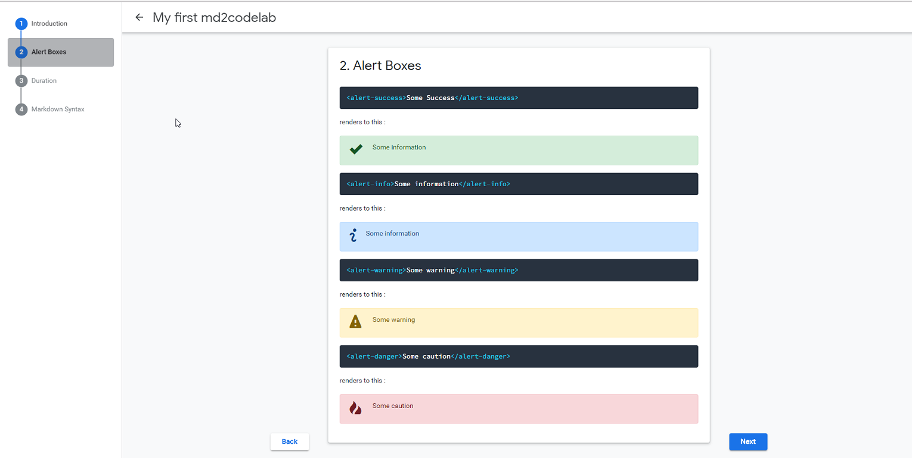
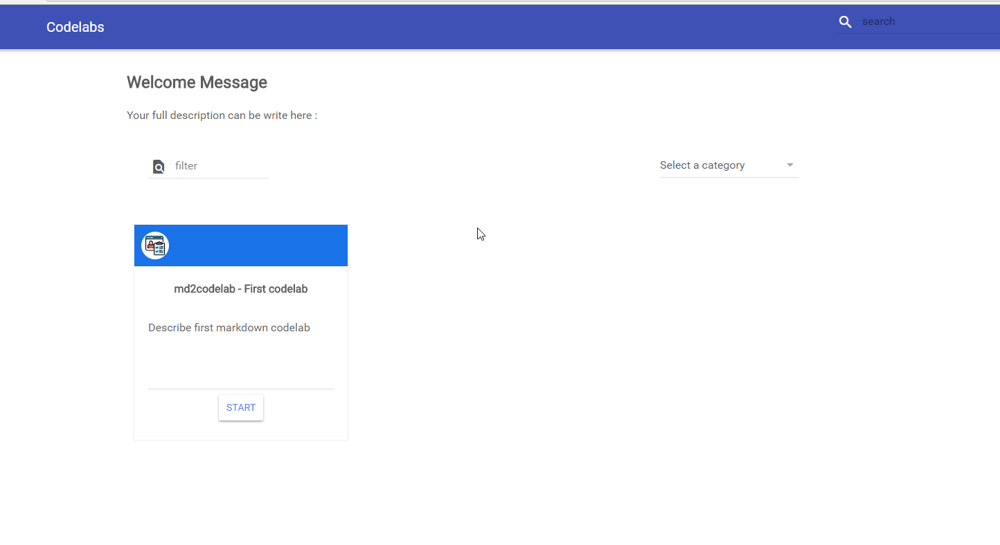

# md2codelab
Inspired by [googlecodelabs](https://github.com/googlecodelabs/), this repository provides another simple tool to convert a markdown file to a complete codelab

The generated codelabs are interactive instructional tutorials, which can be authored in markdown format
using some extra add-ons. This repo contains all the tools and documentation you'll need
for building your own codelabs.

See the [extra/ui] directory for detailed description about the generated entry page.

## What is this ?

This project is completely inspired by [googlecodelabs](https://github.com/googlecodelabs/). 
My personnal experience with the provided [tool](https://github.com/googlecodelabs/tools) by Google was not enough to 
customize my generated codelab. And as far I was using their tool , I've faced a lot of
bugs while parsing markdown file to codelab html. 

Writing this tool, the goal was to provide another tool that supports all the features 
avalaible in markdown. And a complete entry point, to display all the codelabs as provide
by this [google page](https://codelabs.developers.google.com/)

## What are the supported input formats?

* Markdown

## What are the supported output formats?

* Google Codelabs - HTML and Markdown

## What to expect using this tool? 

* creating codelabs using markdown specification and some extra add-ons
* having a main codelabs web page dynamically build like this [one](https://codelabs.developers.google.com/) with a color that depend on category.

## How do I use it ? 

 The best way to start is to clone this repository. 
 
 **To avoid a long way to setup your environment, You will need to install docker to continue !**
 
Following are the list of command for your quick start : 

    git clone https://github.com/bwnyasse/md2codelab.git
    cd md2codelab/.quickstart/
    
    # You must complete file `md/config.yaml` to update the app url location and messages    
    # Launch the compilation => output dir is build/
    /bin/bash build.sh --launch

    #if the build is done!
    cd build/
    
    # You can launch any http server  
    python -m SimpleHTTPServer    
 
 
When navigating to the url provide by simpleHTTPServer, you will find a page like the following : 

